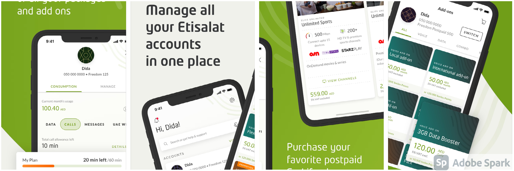
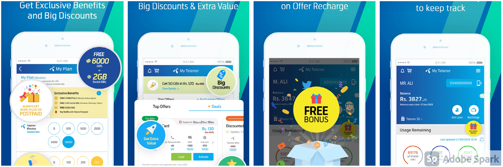
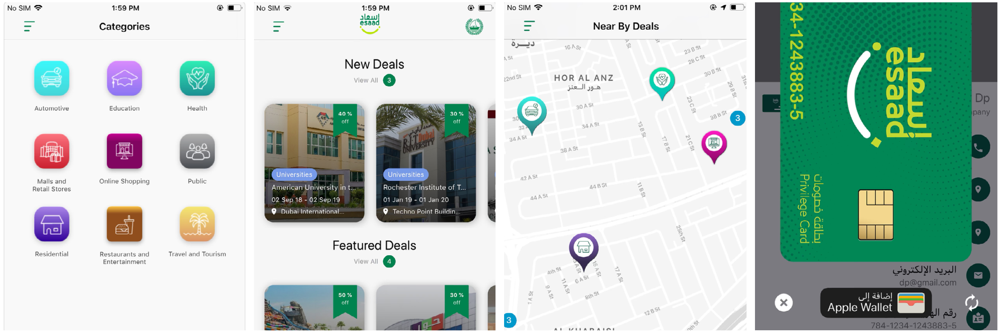
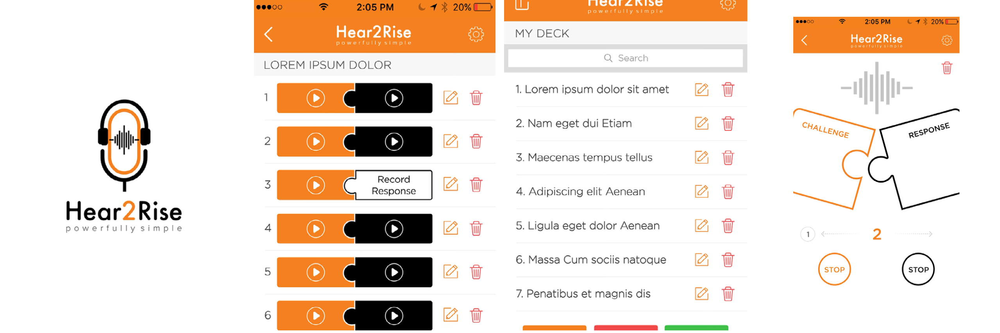
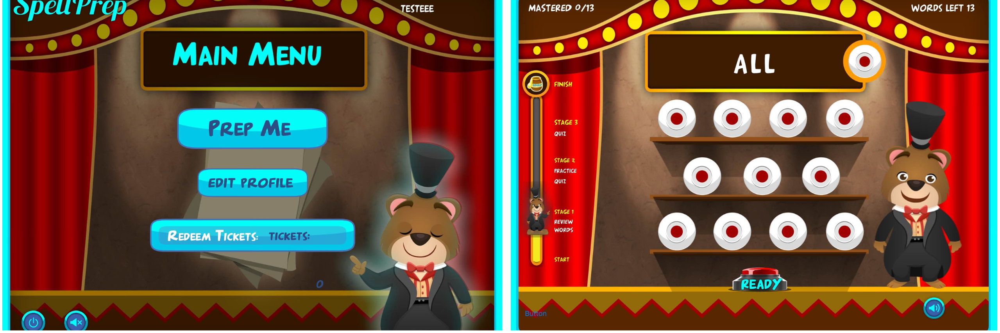
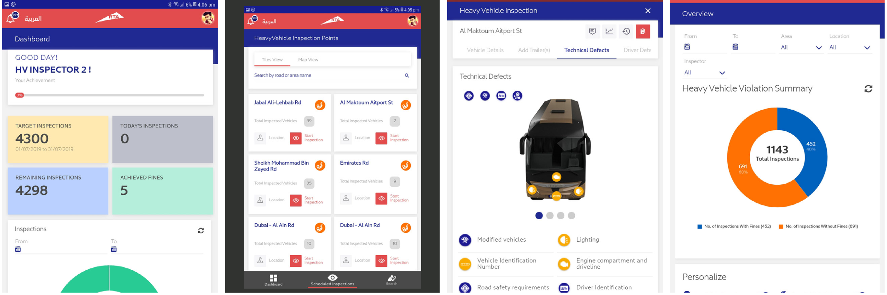

## Yale Home

[Yale Home](https://apps.apple.com/ae/app/yale-home/id1670570711) Yale Home offers everyday convenience and reliable security for home with smart security solutions. It is developed to help users protect the things that matter most to them.

##### 🔨Technologies: SWIFT, SwiftUI, MVVM, Push Notifications, REST API, Pubsub channels, Location services.
##### 🚀Platform: 📱iOS, iPad.

## IKEA Shoppable app

[IKEA Shoppable app](https://apps.apple.com/us/app/ikea/id1452164827?uo=4&at=11l6hc&ct=fnd) Ikea shoppable app is a mobile application built on swiftUI and server driven UI paradigm, using this application users can shop at Ikea using their smartphones.

##### 🔨Technologies: SWIFT, SwiftUI, MVVM, Push Notifications, REST API, Firebase.
##### 🚀Platform: 📱iOS, iPad.

## MY ETISALAT UAE

[Etisalat](https://apps.apple.com/us/app/my-etisalat-%20uae/id866147547?app=itunes&ign-mpt=uo%3D4) My Etisalat app is used to manage all your Etisalat account, monitor the usage of all the packages and add ons you are subscribed to, enjoy a variety of personalized deals, subscribe instantly to your favorite Etisalat data, roaming call internet and TV packages and much more.

##### 🔨Technologies: SWIFT, OBJECTIVE-C, MVC + Clean Architecture, Push Notifications, AWS SDK, REST API.
##### 🚀Platform: 📱iOS, iPad.

## MY TELENOR APP (TELENOR PAKISTAN)
[MY TELENOR](https://apps.apple.com/us/app/my-telenor/id1087721779?app=itunes&ign-%20mpt=uo%3D4) My Telenor App makes your life easy, exciting and hassle free with a single tap! This app is a one stop solution to all your Telenor mobile number related needs; Here you can manage your account easily with a few taps.

##### 🔨Technologies: SWIFT, MVVM + Clean Architecture, Push Notifications, Google Maps, REST API, Realm.
##### 🚀Platform: 📱iOS, iPad.

## ESAAD (DUBAI POLICE)
[ESAAD](https://apps.apple.com/us/app/esaad-card/id1475890066?app=itunes&ign-%20mpt=uo=4) Esaad Card app includes special offers and deals and comprehensive discounts in all sectors covering all sectors that cover the basic and desirable aspects of the cardholders' lives.
The app includes the following services:
◦ Registration of card holders and Retailers in participated companies. ◦ Search for offers and privileges.
◦ Dashboard and deals availed.
◦ Esaad digital card.
◦ Deals near to me.

##### 🔨Technologies: SWIFT, MVC, Push Notifications, Google Maps, REST API, Core Data.
##### 🚀Platform: 📱iOS, iPad.

## Hear2Rise
[Hear2Rise](https://apps.apple.com/us/app/hear2rise/id1162237802?app=itunes) An audio recording app in which users can login and create decks and their custom cards (Audios) and their proper syncing with server. Used core data for local data storage.

##### 🔨Technologies: SWIFT, MVC , Push Notifications, AudioKit, REST API, Core Data, AWS.
##### 🚀Platform: 📱iOS.

## SPELL PREP
[SPELL PREP](https://apps.apple.com/us/app/spell-prep/id1114714056?app=itunes&ign-mpt=uo%3D4) Spell prep is a spelling learning game for kids which contains three rounds and a quiz at the end when you get all words correct you will get stickers. You can customize those stickers and put text in it there are 100’s of stickers for kids. There are words lists with grades the higher the grade more difficult the word will be.

##### 🔨Technologies: Objective-C, MVC , Push Notifications, CoreGraphics, REST API, Core Data, AWS.
##### 🚀Platform: 📱iPhone, iPad.

## RTA - MONITORING & ENFORCEMENT (Mobile Application)
[RTA-MES](https://drive.google.com/drive/folders/1BHkeMLWhtGAlF685Eo0eVmrhFbbBA05E) MES Mobile application used by RTA Inspectors to perform their daily inspections.
◦ Multiple user interfaces and dashboards (Inspectors, Supervisors, Directors. ◦ Search and Filter inspections.
◦ User Profile Management.
◦ Dashboards and Visual Reports.
◦ Notifications
◦ Printing fine receipt with Bluetooth Printer. ◦ Offline Mode.

##### 🔨Technologies: Ionic 3, Cordova, Push Notifications, Sqlite, REST API, ZPL (Zebra bluetooth printer connectivity).
##### 🚀Platform: 📱Android, Tablet.

